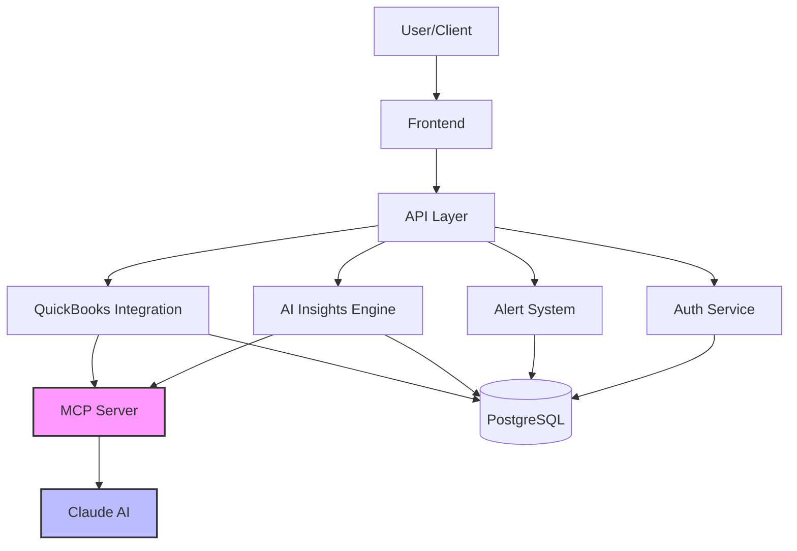
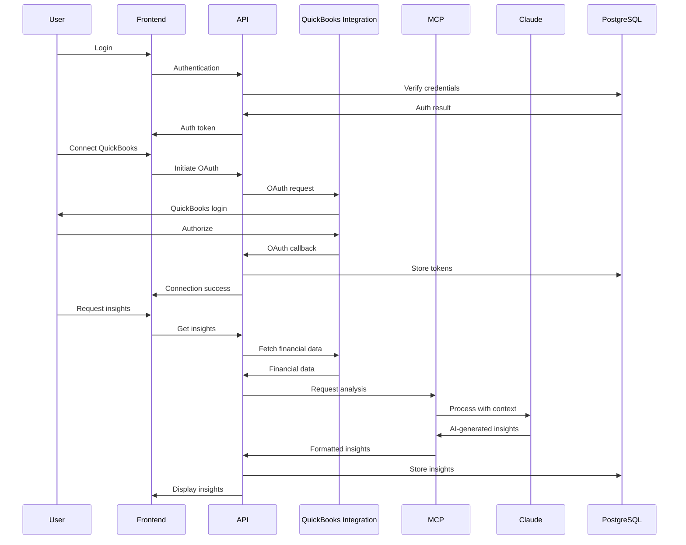

# AI-Powered Accounting Application: Integration Report

## Executive Summary

This report analyzes the current state of the AI-powered accounting application project and evaluates existing software components that could be integrated to accelerate development. After reviewing the project setup and three potential source projects, we've identified several high-value components that could be leveraged, particularly from the financial-insights-mvp project which already implements QuickBooks integration and AI-powered financial analysis.

Key recommendations:
- Complete the initial project setup with proper Git configuration and database initialization
- Adopt the QuickBooks OAuth integration from financial-insights-mvp as a foundation
- Leverage the MCP server implementation from FullPipe for AI integration
- Implement a phased roadmap tracking system similar to FullPipe's for the QuickBooks to standalone transition
- Prioritize security and data protection throughout the integration process

## 1. Project Setup Status

### Repository Setup

The repository has been initialized with Git, but no commits have been made yet. All files are currently untracked.

**Status:**
- ✅ Git repository initialized
- ✅ Appropriate .gitignore file in place
- ❌ No commits made yet
- ❌ No branches established

**Improvements Made:**
- None yet, as this is an initial assessment

**Outstanding Tasks:**
- Make initial commit with all base files
- Create development branch
- Configure Git hooks for linting and testing
- Set up GitHub Actions or similar CI/CD pipeline

### Development Environment

The project has a well-structured Node.js/TypeScript environment with appropriate dependencies and configuration files.

**Status:**
- ✅ Dependencies defined in package.json
- ✅ TypeScript configuration in place
- ✅ ESLint and Prettier configured
- ✅ Jest testing framework set up
- ✅ Database migration and seeding scripts available

**Improvements Made:**
- None yet, as this is an initial assessment

**Outstanding Tasks:**
- Install dependencies
- Verify build process works
- Set up database and run migrations
- Create environment variables file from .env.example

### Project Structure

The project follows a well-organized structure with clear separation of concerns.

**Status:**
- ✅ Modular architecture with separate directories for API, controllers, models, etc.
- ✅ Clear separation between frontend and backend code
- ✅ Database migrations and seeds properly organized
- ✅ Testing directory structure in place

**Improvements Made:**
- None yet, as this is an initial assessment

**Outstanding Tasks:**
- Consider adding dedicated directories for AI integration components
- Create MCP server directory structure
- Add documentation directory for architecture diagrams and API docs

## 2. Project Goals Analysis

### Accounting Application Requirements

Based on the accounting-project-guide.md, the project aims to build an AI-powered accounting application with the following key requirements:

1. **Initial QuickBooks Integration**: Start by integrating with QuickBooks Online as the system of record
2. **AI-Powered Features**: Leverage Claude and other AI models through MCP for intelligent features
3. **Phased Approach**: Gradually transition from QuickBooks integration to a standalone accounting platform
4. **Target Users**: Accounting firms (who can resell to clients) and SMBs

### Key Success Criteria

1. **Seamless QuickBooks Integration**: Reliable synchronization with minimal user friction
2. **Valuable AI Insights**: Providing actionable financial intelligence beyond raw data
3. **Intuitive User Experience**: Easy-to-use interface for both accountants and business owners
4. **Secure Data Handling**: Robust security for sensitive financial information
5. **Smooth Transition Path**: Clear migration path from QuickBooks to standalone solution

### Technical Constraints

1. **MCP Integration**: Must use Model Context Protocol for AI model integration
2. **Modern Tech Stack**: Node.js/TypeScript backend with React frontend
3. **Database Requirements**: PostgreSQL for financial data
4. **Security Standards**: Must implement proper authentication, encryption, and audit logging
5. **API-First Design**: All functionality should be accessible via well-documented APIs

### Identified Risks and Dependencies

1. **QuickBooks API Limitations**: Potential restrictions or rate limits
2. **AI Model Reliability**: Ensuring accuracy of AI-generated insights
3. **Data Migration Complexity**: Challenges in transitioning from QuickBooks to standalone
4. **Regulatory Compliance**: Meeting accounting and financial regulations
5. **User Adoption Barriers**: Overcoming resistance to new technology

## 3. Inventory of Reusable Components

### AI Task Manager

**Origin Project**: ai-task-manager

**Components**:
1. **Task Tracking System**: Manages development tasks and their completion status
2. **Claude AI Integration**: Prepares and sends task prompts to Claude
3. **Context Management**: Maintains context between tasks for better continuity
4. **VS Code Integration**: Runs task commands directly from VS Code

**Technical Characteristics**:
- Bash and Python scripts for task management
- JSON-based task and context storage
- Command-line interface with VS Code integration
- Template-based prompt generation

### Financial Insights MVP

**Origin Project**: financial-insights-mvp

**Components**:
1. **QuickBooks OAuth Integration**: Complete OAuth2 flow implementation
2. **Financial Data Sync**: Account and transaction synchronization
3. **AI-Powered Analysis**: Automated financial insights generation
4. **Alert System**: Customizable threshold monitoring and notifications
5. **Financial Forecasting**: Cash flow and revenue projections
6. **User Authentication**: JWT-based authentication system

**Technical Characteristics**:
- Node.js/TypeScript backend
- PostgreSQL database with Knex.js
- RESTful API design
- JWT authentication
- OpenAI API integration for insights

### FullPipe

**Origin Project**: FullPipe

**Components**:
1. **MCP Server Implementation**: Model Context Protocol server for AI integration
2. **Roadmap Tracking System**: Visual tracking of project progress
3. **API Gateway**: Central entry point for microservices
4. **Security Enforcement**: Security scanning and vulnerability detection
5. **Frontend Components**: React-based dashboard and visualization

**Technical Characteristics**:
- Microservices architecture
- FastAPI and Node.js services
- React frontend with Material UI
- PostgreSQL and ChromaDB databases
- Containerization with Podman and Chainguard

## 4. Integration Analysis

### QuickBooks OAuth Integration

**Origin**: financial-insights-mvp

**Integration Approach**:
- Directly adopt the OAuth2 flow implementation
- Reuse token management and refresh logic
- Adapt the API client for our specific needs

**Modifications Needed**:
- Update environment variable handling
- Integrate with our user authentication system
- Add additional error handling and logging

**Potential Challenges**:
- Ensuring proper token storage and security
- Handling QuickBooks API version changes

**Effort Level**: Low (high reuse potential)

### Financial Data Sync Engine

**Origin**: financial-insights-mvp

**Integration Approach**:
- Adopt the data synchronization logic
- Reuse the database schema for financial data
- Adapt the sync scheduling mechanism

**Modifications Needed**:
- Align with our database models
- Enhance error recovery mechanisms
- Add support for additional QuickBooks entities

**Potential Challenges**:
- Handling large datasets efficiently
- Ensuring data consistency

**Effort Level**: Medium

### MCP Server Implementation

**Origin**: FullPipe

**Integration Approach**:
- Adapt the MCP server implementation for accounting-specific needs
- Reuse the tool and resource registration patterns
- Implement accounting-specific tools and resources

**Modifications Needed**:
- Create accounting-specific tools (transaction analysis, categorization, etc.)
- Implement financial data resources
- Enhance security for sensitive financial data

**Potential Challenges**:
- Ensuring proper context management for financial data
- Optimizing performance for large datasets

**Effort Level**: Medium

### Roadmap Tracking System

**Origin**: FullPipe

**Integration Approach**:
- Adapt the roadmap tracker for our phased approach
- Reuse the visualization components
- Simplify for our specific needs

**Modifications Needed**:
- Customize phases for our QuickBooks to standalone transition
- Adapt the API for our project structure
- Simplify the UI for our specific use case

**Potential Challenges**:
- Ensuring proper integration with our project management
- Adapting the visualization for our specific roadmap

**Effort Level**: Low

### AI-Powered Analysis

**Origin**: financial-insights-mvp

**Integration Approach**:
- Adapt the analysis logic to use Claude via MCP instead of OpenAI
- Reuse the insight generation patterns
- Enhance with accounting-specific templates

**Modifications Needed**:
- Replace OpenAI API calls with MCP-based Claude integration
- Enhance prompts for accounting-specific insights
- Add feedback mechanisms to improve AI responses

**Potential Challenges**:
- Ensuring accuracy of AI-generated insights
- Optimizing context management for financial data

**Effort Level**: Medium

### Alert System

**Origin**: financial-insights-mvp

**Integration Approach**:
- Adopt the alert configuration and notification system
- Reuse the threshold monitoring logic
- Enhance with AI-powered anomaly detection

**Modifications Needed**:
- Integrate with our notification system
- Add AI-powered anomaly detection
- Enhance customization options

**Potential Challenges**:
- Balancing sensitivity to avoid alert fatigue
- Ensuring timely delivery of critical alerts

**Effort Level**: Low

## 5. Code Quality Assessment

### AI Task Manager

**Maintainability**: Medium
- Simple bash and Python scripts
- Limited documentation
- Minimal error handling

**Documentation**: Low
- Basic README with usage instructions
- Limited inline comments
- No API documentation

**Testing**: Low
- No automated tests visible
- Manual testing only

**Technical Debt**: Medium
- Hardcoded paths and values
- Limited error handling
- Potential scalability issues with JSON storage

### Financial Insights MVP

**Maintainability**: High
- Well-structured TypeScript code
- Clear separation of concerns
- Modular architecture

**Documentation**: High
- Comprehensive README
- API documentation with examples
- Clear code comments

**Testing**: Medium
- Jest testing framework set up
- Some tests likely implemented
- Coverage unclear

**Technical Debt**: Low
- Modern TypeScript practices
- Well-defined interfaces
- Clear error handling

### FullPipe

**Maintainability**: Medium
- Microservices architecture with clear boundaries
- Some services more mature than others
- Complex integration points

**Documentation**: High
- Detailed architecture documentation
- API documentation
- Visual diagrams

**Testing**: Medium
- Testing directories present
- Integration tests mentioned
- Coverage unclear

**Technical Debt**: Medium
- Some services in early development
- Complex dependencies between services
- Potential duplication across services

### Compatibility with Our Tech Stack

All three projects align well with our intended tech stack:
- Node.js/TypeScript (financial-insights-mvp and parts of FullPipe)
- React frontend (FullPipe)
- PostgreSQL database (financial-insights-mvp and FullPipe)
- API-first design (all projects)

The financial-insights-mvp project has the highest compatibility, as it uses almost identical technologies to our planned stack.

## 6. Architectural Recommendations

### Overall Architecture

We recommend a hybrid approach that combines:
1. The monolithic backend structure of financial-insights-mvp for initial development speed
2. The MCP integration pattern from FullPipe for AI capabilities
3. The phased development approach outlined in FullPipe's roadmap tracker

### Data Flow

### Component Integration

1. **Backend Core**: Adopt the financial-insights-mvp backend structure
   - Reuse the authentication, database, and API layers
   - Adapt the QuickBooks integration

2. **AI Integration**: Implement the MCP server from FullPipe
   - Create accounting-specific tools and resources
   - Integrate with Claude for AI capabilities

3. **Frontend**: Develop a React-based frontend
   - Adapt visualization components from FullPipe
   - Implement financial dashboards based on financial-insights-mvp

4. **Project Management**: Adapt the roadmap tracker from FullPipe
   - Track the transition from QuickBooks to standalone
   - Visualize project progress

### Alternative Approaches

1. **Microservices from Start**: 
   - Pros: Better long-term scalability, clearer service boundaries
   - Cons: Higher initial complexity, slower development speed
   - Recommendation: Start with a monolithic approach and gradually migrate to microservices as needed

2. **Direct AI Integration without MCP**:
   - Pros: Simpler initial implementation
   - Cons: Less flexibility, harder to switch AI providers, security concerns
   - Recommendation: Use MCP from the start to ensure proper security and flexibility

3. **Build Everything from Scratch**:
   - Pros: Complete control over all components
   - Cons: Much slower development, reinventing the wheel
   - Recommendation: Leverage existing components where possible to accelerate development

## 7. Implementation Priority

### Phase 1: Foundation (Weeks 1-4)

1. **Project Setup** (High Priority)
   - Set up Git repository and branches
   - Configure development environment
   - Initialize database

2. **QuickBooks Integration** (High Priority)
   - Implement OAuth flow from financial-insights-mvp
   - Set up data synchronization
   - Create basic data models

3. **User Authentication** (High Priority)
   - Implement JWT-based authentication
   - Set up user management
   - Configure security middleware

### Phase 2: Core Functionality (Weeks 5-8)

1. **MCP Server Implementation** (High Priority)
   - Adapt FullPipe's MCP server
   - Create accounting-specific tools
   - Implement financial data resources

2. **Basic Financial Dashboards** (Medium Priority)
   - Implement account overview
   - Create transaction history view
   - Develop basic reporting

3. **Alert System** (Medium Priority)
   - Implement threshold monitoring
   - Set up notification system
   - Create alert configuration UI

### Phase 3: AI Enhancement (Weeks 9-12)

1. **AI-Powered Insights** (High Priority)
   - Implement financial analysis with Claude
   - Create insight templates
   - Develop feedback mechanisms

2. **Automated Categorization** (Medium Priority)
   - Implement transaction categorization with AI
   - Create learning mechanisms
   - Develop approval workflows

3. **Financial Forecasting** (Medium Priority)
   - Implement cash flow projections
   - Create revenue forecasting
   - Develop scenario analysis

### Phase 4: Transition Preparation (Weeks 13-16)

1. **Standalone Accounting Features** (High Priority)
   - Implement double-entry ledger
   - Create chart of accounts management
   - Develop journal entry system

2. **Migration Tools** (High Priority)
   - Create data migration utilities
   - Implement validation tools
   - Develop onboarding flows

3. **Roadmap Tracking** (Low Priority)
   - Adapt FullPipe's roadmap tracker
   - Create transition visualization
   - Implement progress tracking

## 8. Risk Assessment

### Technical Challenges

1. **QuickBooks API Limitations**
   - Risk: Rate limits, API changes, or feature gaps
   - Mitigation: Implement caching, batch processing, and fallback mechanisms

2. **AI Accuracy and Reliability**
   - Risk: Inaccurate or misleading AI-generated insights
   - Mitigation: Implement validation rules, confidence scores, and human review

3. **Data Migration Complexity**
   - Risk: Data loss or corruption during QuickBooks to standalone transition
   - Mitigation: Develop comprehensive testing, validation tools, and rollback capabilities

4. **Performance with Large Datasets**
   - Risk: Slow performance with large financial datasets
   - Mitigation: Implement pagination, caching, and database optimization

### Licensing Issues

1. **financial-insights-mvp**: MIT License
   - No significant restrictions on usage
   - Attribution required

2. **FullPipe**: MIT License
   - No significant restrictions on usage
   - Attribution required

3. **ai-task-manager**: MIT License
   - No significant restrictions on usage
   - Attribution required

All projects use permissive MIT licenses, which allow for commercial use, modification, and distribution with minimal restrictions.

### Security Concerns

1. **Financial Data Protection**
   - Risk: Exposure of sensitive financial information
   - Mitigation: Implement encryption, access controls, and audit logging

2. **Authentication Security**
   - Risk: Unauthorized access to user accounts
   - Mitigation: Implement strong authentication, MFA, and session management

3. **AI Context Management**
   - Risk: Leakage of sensitive data to AI models
   - Mitigation: Use MCP to control context, implement data filtering

4. **API Security**
   - Risk: Unauthorized API access or abuse
   - Mitigation: Implement rate limiting, API keys, and proper authentication

5. **Dependency Vulnerabilities**
   - Risk: Security issues in third-party dependencies
   - Mitigation: Regular dependency scanning and updates

## Conclusion

The reviewed projects provide valuable components that can significantly accelerate the development of our AI-powered accounting application. The financial-insights-mvp project offers the most directly applicable functionality with its QuickBooks integration and financial analysis features. The FullPipe project provides an excellent MCP implementation and roadmap tracking system that aligns well with our phased approach.

By strategically integrating these components while maintaining a focus on security, data integrity, and user experience, we can build a robust accounting application that leverages AI to provide valuable insights while ensuring a smooth transition from QuickBooks integration to a standalone solution.

We recommend proceeding with the implementation priority outlined in this report, starting with the foundation phase to establish the core infrastructure and QuickBooks integration, followed by the progressive addition of AI capabilities and standalone accounting features.
